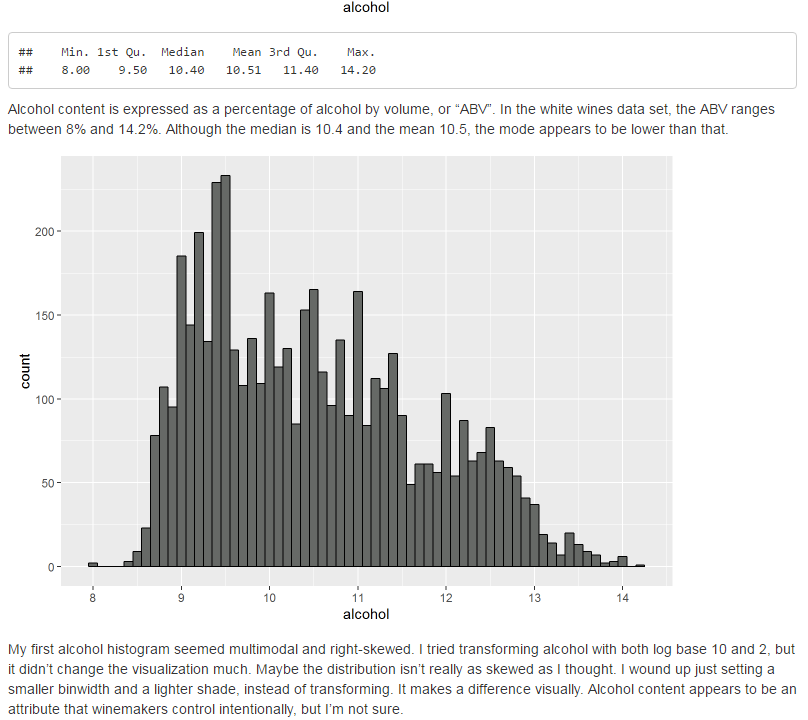

# Exploratory Data Analysis using R:

### Visually Analyze and Summarize Data Sets

A preview (see White Wines Data Exploration):



#### An [online course offered by Udacity.](https://www.udacity.com/course/data-analysis-with-r--ud651)  
Click the link for more details. The course is part of Udacity's _Data Analyst Nanodegree_ program.

This repo contains my code for the both the Final Project (_White Wines Data Exploration_) and two earlier problem sets (_Problem Set 3_ and _Problem Set 4_) from the course.

The course focused on the use of plots and visualization to get a "quick and dirty" grasp of what's going on in a given data set.

It was not a course in learning R. Rather, since the focus was on plotting, the ```ggplot``` package for R was heavily emphasized. Still, I had to learn a little bit about R syntax and working with data frames and statistics in R, in order to tidy up the data before visualizing it. The course was challenging because it was my first exposure to the R language.

---

Most of the code written in ```rmarkdown``` in [RStudio,](https://www.rstudio.com/), and probably is best viewed in RStudio. Packages used in the project include [ggplot2](http://ggplot2.org/), [gridExtra](https://cran.r-project.org/package=gridExtra), [grid](https://cran.r-project.org/package=grid), [dplyr](https://cran.r-project.org/package=dplyr), and [tidyr.](https://cran.r-project.org/package=tidyr).

Some code was written in R and saved as a .r file. This could be viewed in any useful code editor. (The .rmd markdown files could be, too).
