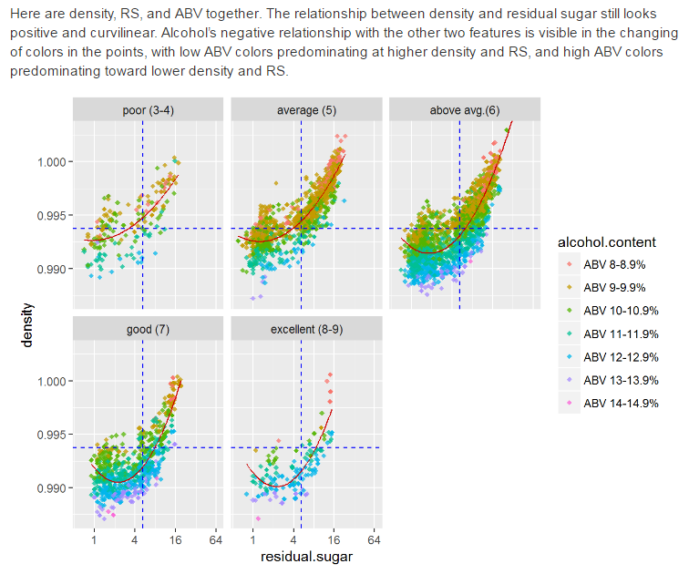
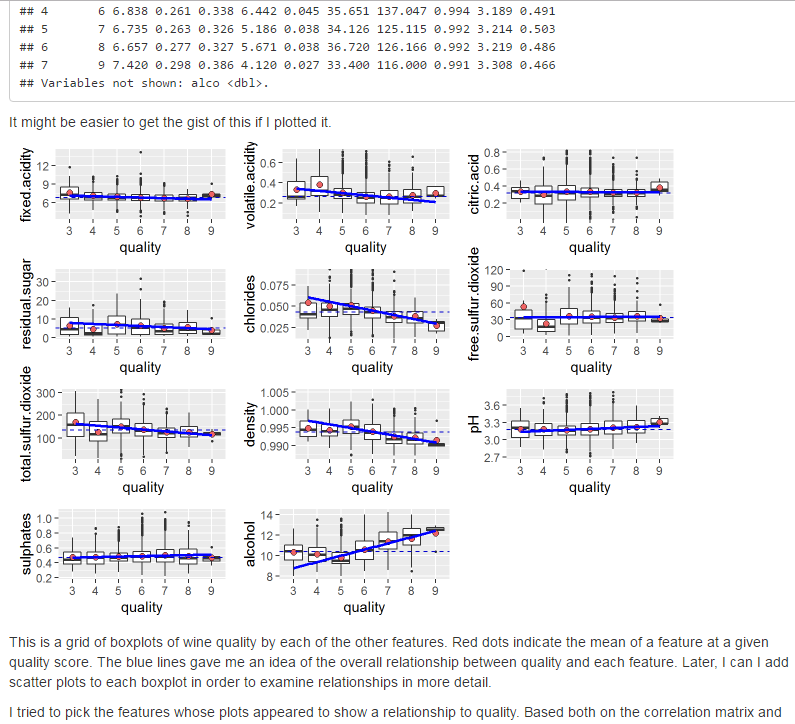
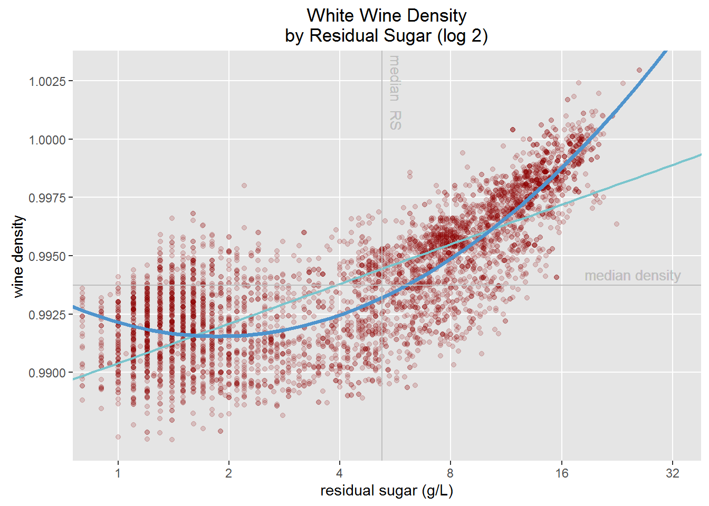
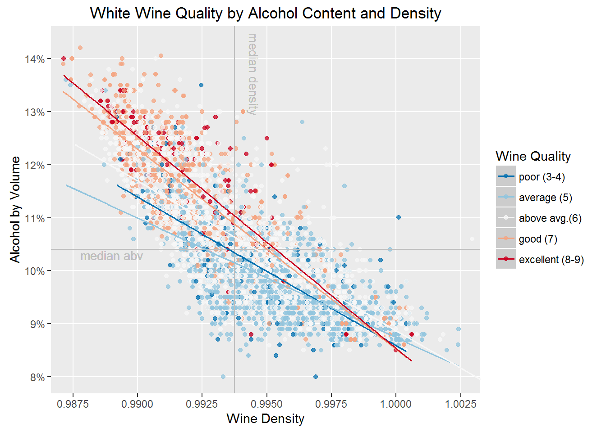

# White Wines Exploration by Jeff Hartl
## From Udacity course "Exploratory Data Analysis with R"
### Project 4 in Data Analyst Nanodegree

In this project, I used **R**, [https://www.r-project.org/about.html]("a language and environment for statistical computing and graphics.") -- in particular the ```ggplot``` visualization package for R) -- and applied exploratory data analysis techniques to explore relationships in one, two, and multiple variables. I explored a selected data set for distributions, outliers, and anomalies.

### Sample plots from the project:










### Contents  

**explore_your_data.R**
* A sort of "scratch pad" of trial-and-error R code I tinkered with while putting together the project.
Quite a bit of this code wound up in the final RMarkdown code that I wrote (i.e., "P4_White_Wines_Data_Exploration.Rmd").
Quite a bit of it was in the RMarkdown file at one time, and later removed as I edited and refined it.

**P4_White_Wines_Data_Exploration.Rmd**
* The project code in R and RMarkdown.

**Project Instructions - Explore and Summarize Data.md**
* Details about the structure, parameters, and goals of the project.

**Udacity Reviews P4.pdf**
* Review and feedback on project, from a qualified Udacity reviewer.

**White_Wines_Data_Exploration.html**
* User-friendly view of the project. Can be viewed in a web browser. Knitted into HTML using RStudio.

**wine project reference list.md**
* A list of key sources I used during my work on this project.


### Links to Data Set and Info about it

[White Wine Quality data set in CSV format](https://www.google.com/url?q=https://s3.amazonaws.com/udacity-hosted-downloads/ud651/wineQualityWhites.csv&sa=D&ust=1466285795591000&usg=AFQjCNF5WiNV1SSB6DS2xqEvtNNmz3_Y4g)

The accompanying [text file which "describes the variables and how the data was collected"](https://www.google.com/url?q=https://s3.amazonaws.com/udacity-hosted-downloads/ud651/wineQualityInfo.txt&sa=D&ust=1466285795592000&usg=AFQjCNFSj5jJdJG5s75mLjVzjt4Zi5_t5g)


### Notes
The code for this project was written primarily in [RStudio,](https://www.rstudio.com/), and probably is best viewed in RStudio. Packages used in the project include [ggplot2](http://ggplot2.org/), [gridExtra](https://cran.r-project.org/package=gridExtra), [grid](https://cran.r-project.org/package=grid), [dplyr](https://cran.r-project.org/package=dplyr), and [tidyr.](https://cran.r-project.org/package=tidyr).